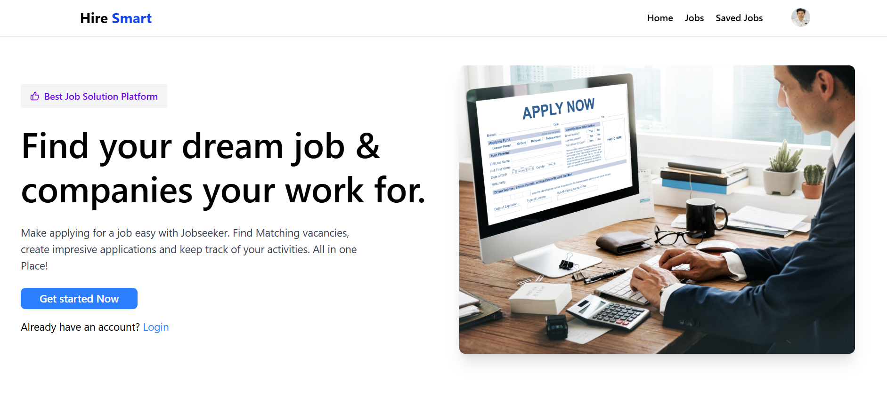

# 🧑‍💼 Job Portal

<p align="center">
  
  
  
  
  
  
</p>

---

## 🚀 About the Project

The **Job Portal** is a modern, full-featured platform for job seekers and recruiters. Recruiters can post jobs, manage applicants, and track applications. Job seekers can browse, filter, apply for jobs, upload resumes, and track their applications. The platform is built with a modern tech stack and offers a beautiful, responsive UI.

---

## 📸 Screenshots

> *(Add images of your UI here)*  
> Example:  
> 

---

## 🛠️ Tech Stack

- **Frontend:** React.js, Tailwind CSS, Shadcn/UI, Redux Toolkit  
- **Backend:** Node.js, Express.js, MongoDB  
- **Deployment:** Render / Vercel / Netlify  
- **Voice AI (optional):** react-speech-recognition

---

## 🔑 Features

- 👤 User authentication (Sign up, Login)
- 📝 Recruiters can post and manage jobs
- 🧑‍💼 Job seekers can browse and apply for jobs
- 📄 Resume upload and profile management
- 🔎 Filter and sort jobs by category, location, etc.
- 💬 Voice assistant integration (optional)
- 💾 Save jobs & track applied jobs
- 📧 Email notifications for key actions
- 🏢 Company management for recruiters
- 📊 Admin dashboard for job and applicant management
- 🎨 Responsive & modern UI

---

## 📦 Installation & Setup

### 1. Clone the repository
```bash
git clone https://github.com/Himanshusinghjeena/Job-Portal.git
cd Job-Portal
```

### 2. Setup Backend
```bash
cd backend
npm install
# Create a .env file (see .env.example if available)
npm start
```

### 3. Setup Frontend
```bash
cd ../frontend
npm install
npm run dev
```

- Frontend: http://localhost:5173
- Backend: http://localhost:5000

---

## 🧭 How It Works

### 👤 For Job Seekers
- Sign up and complete your profile
- Browse and filter jobs
- Save jobs for later or apply directly
- Upload your resume and track your applications

### 🧑‍💼 For Recruiters
- Register as a recruiter/company
- Post new job openings
- Manage applicants and view applications
- Track application status and communicate with candidates

---

## 🤝 Contributing
1. Fork the repo
2. Create your feature branch (`git checkout -b feature/YourFeature`)
3. Commit your changes (`git commit -m 'Add some feature'`)
4. Push to the branch (`git push origin feature/YourFeature`)
5. Open a Pull Request

---

## 📄 License
MIT 
